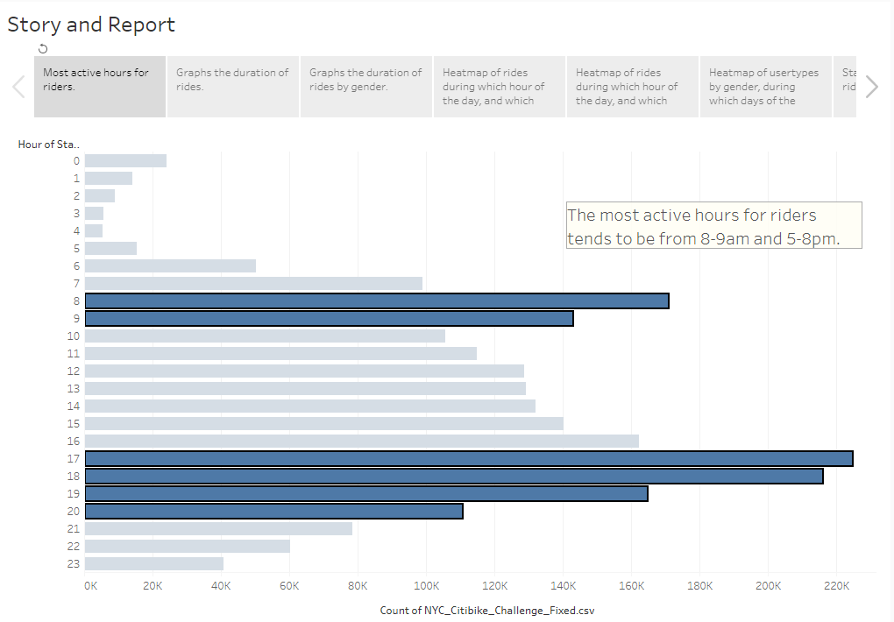
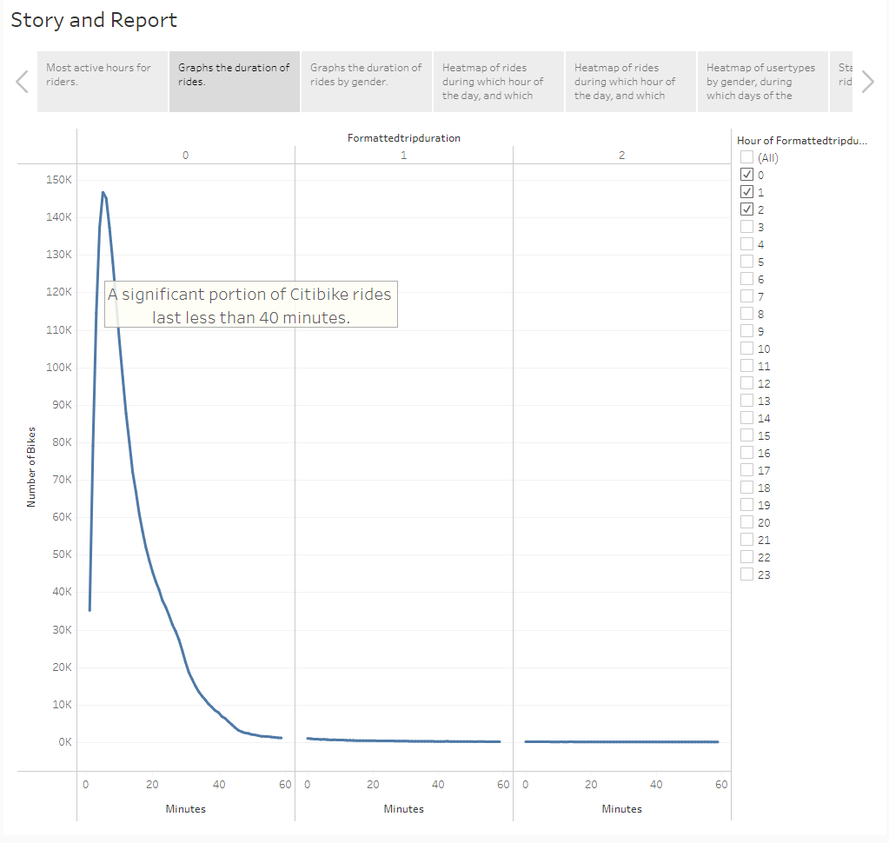
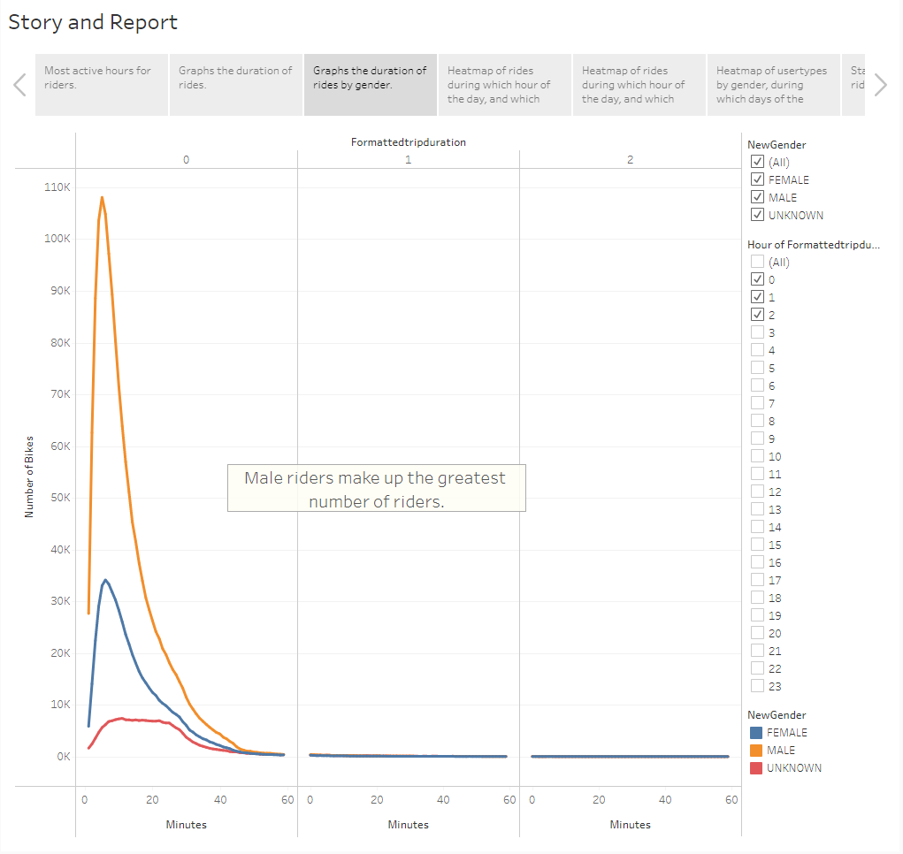
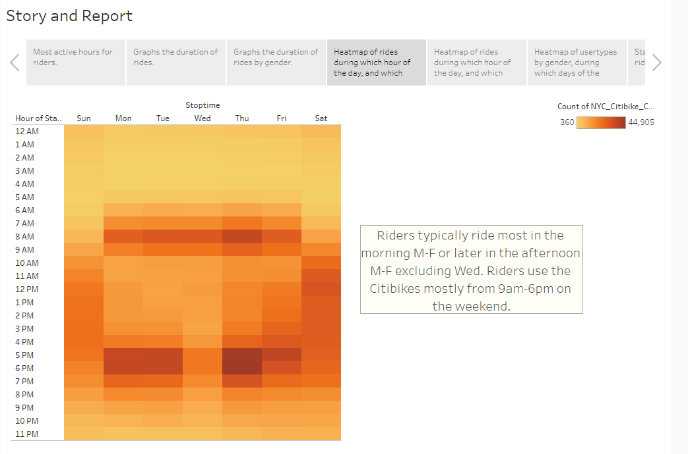
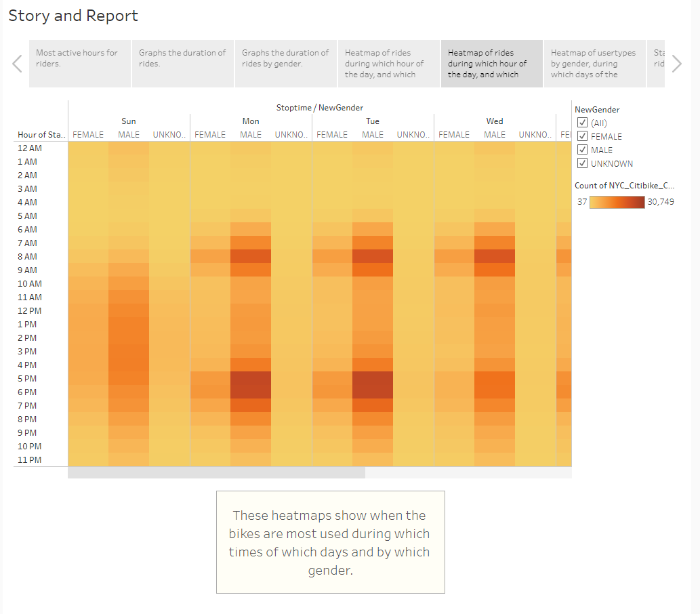
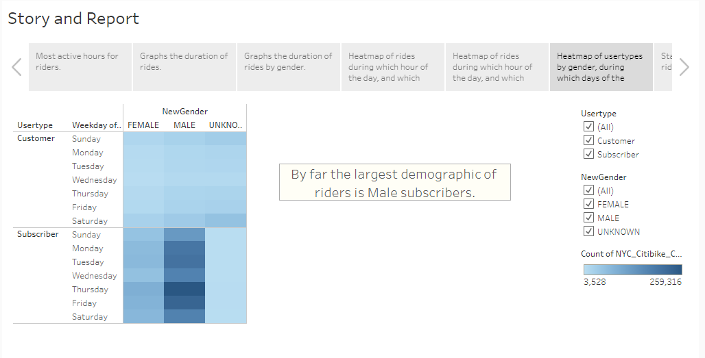

# Module 14 Challenge, Deliverable 3
 
## Overview of the analysis
The purpose of this analysis is to determine whether Citibike should expand its bike-sharing program from a heavily populated city like NYC to Des Moines, a city that has a fraction of the population. We are conducting an analysis on the program based on data from NYC for the month of August 2019. In this challenge, we are helping our friend Kate pitch our expansion idea to the board of investors of Citibike.

## Results
Here are some of the results of the analysis conducted on the Citibike data from NYC, August 2019:

The bar graph shows which hours of use are most popular for all riders. According to the graph, the most active hours for riders tends to be from 8-9am and 5-8pm. The least active hours for riders are from 2-4am. From the module, we agreed that in the case that maintenance needed to be performed on the bikes, these would be the ideal hours to do so.

The line graph plots the duration of rides split by how many hours they last. The vast majority of rides do not last longer than 1 hour, so we filtered some of the data to only display the rides that lasted 2 hours or less. The greatest number of rides last around 5-20 minutes long.

This line graph again plots the duration of rides split by how many hours they last, but also plots points depending on which gender the rider was. We can see that by far the majority of riders are male. For all riders, most rides still typically last around 5 minutes.

This heat map shows which days of the week and what hours of those days have the most active riders. The legend shows that the darker the color orange equates to more active riders. 

Riders are typically most active in the morning Mon-Fri or later in the afternoon Mon-Fri, exlcuding Wed. On the weekend, riders are active mostly from 9am-6pm.

This heat map shows again the days of the week and what hours of those days have the most active riders, but this time they are broken down by gender.

Male riders are by far the most active. They follow the same pattern as before: most active in the mornings (7-9am) and later afternoons (5-7pm) during weekdays, and active from 9am-6pm on the weekends.

This heat map shows a breakdown of rides by usertype for which day of the week and then by gender. Customer here means that the rider made a one-time payment to access the Citibike, unlike the Subscriber who may pay a montly fee to have access to the bikes whenever they need them.

The map shows that again, by far, males make up the largest demographic of riders, and they are subscribers to the program. They ride every day. Female subscribers are the second largest demographic and they ride every day too.

This map shows the distribution of starting points for every ride given in the data. The legend shows that the more popular a start point is, the larger and closer to red the point will become. We can see that for all riders the most popular starting points are located in the city. The least popular start points are away from the city.

## Summary
To summarize the findings: male subscribers are the largest demographic of riders. Most rides on average occur in the city, have a duration of 5-10 minutes, and occur during the weekdays in the morning before work or later in the afternoon after work hours. The hours of 2am-4am are by far the least active and are a good candidate to perform maintenance on the bikes. Females make up a much smaller portion of the data.

Two additional visualizations I would perform with this dataset are:
- showing another bubble heatmap of where the rides typically end at, and
- showing the average age of the most active riders (this was done in the module but was not included in the challenge)

The second bubble heat map would compliment the first which showcased the most popular starting location of all riders, and
could help the audience understand how far rides typically go in that 5-10 minute window that seems to be the most popular duration. The average age of the most active riders would also help the audience to better understand who the target demographic would be.

[Here is a link to the Tableau Public story.](https://public.tableau.com/app/profile/ethan.dirksen/viz/Module-14-Challenge_16659782276790/Story1?publish=yes)